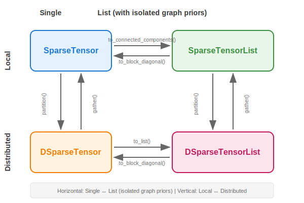

<p align="center">
  
</p>

<h1 align="center">torch-sla</h1>

<p align="center">
  <b>PyTorch Sparse Linear Algebra</b> - A differentiable sparse linear equation solver library with multiple backends.
</p>

<p align="center">
  <a href="https://arxiv.org/abs/2601.13994"></a>
  <a href="https://github.com/walkerchi/torch-sla"></a>
  <a href="https://walkerchi.github.io/torch-sla/"></a>
  <a href="https://badge.fury.io/py/torch-sla"></a>
  <a href="https://opensource.org/licenses/MIT"></a>
  <a href="https://www.python.org/downloads/"></a>
</p>

<p align="center">
  <a href="https://walkerchi.github.io/torch-sla/introduction.html">📖 Introduction</a> •
  <a href="https://walkerchi.github.io/torch-sla/installation.html">🔧 Installation</a> •
  <a href="https://walkerchi.github.io/torch-sla/torch_sla.html">📚 API Reference</a> •
  <a href="https://walkerchi.github.io/torch-sla/examples.html">💡 Examples</a> •
  <a href="https://walkerchi.github.io/torch-sla/benchmarks.html">📊 Benchmarks</a>
</p>

## Features

- 🔥 **Differentiable**: Full gradient support through `torch.autograd`
- 🚀 **Multiple Backends**: SciPy, Eigen (CPU), cuSOLVER, cuDSS, PyTorch-native (CUDA)
- 📦 **Batched Operations**: Support for batched sparse tensors `[..., M, N, ...]`
- 🎯 **Property Detection**: Auto-detect symmetry and positive definiteness
- ⚡ **High Performance**: Auto-selects best solver based on device, dtype, and problem size
- 🌐 **Distributed**: Domain decomposition with halo exchange (CFD/FEM style)
- 🔧 **Easy to Use**: `SparseTensor` class with solve, norm, eigs methods
- 🧮 **Nonlinear Solve**: Adjoint-based Newton/Anderson solvers with implicit differentiation

## Installation

```bash
# Basic installation
pip install torch-sla

# With cuDSS support (CUDA 12+, recommended for GPU)
pip install torch-sla[cuda]

# Full installation with all dependencies
pip install torch-sla[all]

# From source (for development)
git clone https://github.com/walkerchi/torch-sla.git
cd torch-sla
pip install -e ".[dev]"
```

> **Note**: cuDSS (`nvidia-cudss-cu12`) is now available on PyPI! Installing `torch-sla[cuda]` will automatically include it.

## Quick Start

### Basic Solve

```python
import torch
from torch_sla import SparseTensor

# Create sparse matrix from dense (for small matrices)
dense = torch.tensor([[4.0, -1.0,  0.0],
                      [-1.0, 4.0, -1.0],
                      [ 0.0, -1.0, 4.0]], dtype=torch.float64)
A = SparseTensor.from_dense(dense)

# Solve Ax = b
b = torch.tensor([1.0, 2.0, 3.0], dtype=torch.float64)
x = A.solve(b)

# Specify backend and method
x = A.solve(b, backend='scipy', method='superlu')
```

### CUDA Solve

```python
# Move to CUDA
A_cuda = A.cuda()
b_cuda = b.cuda()

# Auto-selects cudss+cholesky (best for CUDA)
x = A_cuda.solve(b_cuda)

# Or explicitly specify
x = A_cuda.solve(b_cuda, backend='cudss', method='cholesky')

# For very large problems (DOF > 2M), use iterative
x = A_cuda.solve(b_cuda, backend='pytorch', method='cg')
```

## Recommended Backends

Based on benchmarks on 2D Poisson equations (tested up to **400M DOF** multi-GPU):

| Problem Size | CPU | CUDA | Notes |
|-------------|-----|------|-------|
| **Small (< 100K DOF)** | `scipy+superlu` | `cudss+cholesky` | Direct solvers, machine precision |
| **Medium (100K - 2M DOF)** | `scipy+superlu` | `cudss+cholesky` | cuDSS is fastest on GPU |
| **Large (2M - 169M DOF)** | N/A | `pytorch+cg` | **Iterative only**, ~1e-6 precision |
| **Very Large (> 169M DOF)** | N/A | `DSparseMatrix` multi-GPU | Multi-GPU domain decomposition |

### Key Insights

1. **PyTorch CG+Jacobi scales to 169M+ DOF** on single GPU with near-linear O(n^1.1) complexity
2. **Multi-GPU scales to 400M+ DOF** with DSparseMatrix domain decomposition (3x H200)
3. **Direct solvers limited to ~2M DOF** due to memory (O(n^1.5) fill-in)
4. **Use float64** for best convergence with iterative solvers
5. **Trade-off**: Direct = machine precision (~1e-14), Iterative = ~1e-6 but 100x faster

## Backends and Methods

### Available Backends

| Backend | Device | Description | Recommended For |
|---------|--------|-------------|-----------------|
| `scipy` | CPU | SciPy (SuperLU/UMFPACK) | **CPU default** - fast + machine precision |
| `eigen` | CPU | Eigen C++ (CG, BiCGStab) | Alternative CPU iterative |
| `cudss` | CUDA | NVIDIA cuDSS (LU, Cholesky, LDLT) | **CUDA default** - fastest direct |
| `cusolver` | CUDA | NVIDIA cuSOLVER | Not recommended (slower, no float32) |
| `pytorch` | CUDA | PyTorch-native (CG, BiCGStab) | Very large problems (> 2M DOF) |

### Solver Methods

| Method | Backends | Best For | Precision |
|--------|----------|----------|-----------|
| `superlu` | scipy | General matrices | Machine precision |
| `cholesky` | cudss, cusolver | **SPD matrices (fastest)** | Machine precision |
| `ldlt` | cudss | Symmetric matrices | Machine precision |
| `lu` | cudss, cusolver | General matrices | Machine precision |
| `cg` | scipy, eigen, pytorch | SPD matrices (iterative) | ~1e-6 to 1e-7 |
| `bicgstab` | scipy, eigen, pytorch | General (iterative) | ~1e-6 to 1e-7 |

## Batched Solve

```python
# Batched matrices: same structure, different values
batch_size = 4
val_batch = val.unsqueeze(0).expand(batch_size, -1).clone()

# Create batched SparseTensor [B, M, N]
A = SparseTensor(val_batch, row, col, (batch_size, 3, 3))

# Batched solve
b = torch.randn(batch_size, 3, dtype=torch.float64)
x = A.solve(b)  # Shape: [batch_size, 3]
```

## Distributed Computing (DSparseMatrix)

For large-scale problems across multiple GPUs, use domain decomposition:

```python
import torch.distributed as dist
from torch_sla.distributed import DSparseMatrix, partition_simple

# Initialize distributed (each process runs this)
dist.init_process_group(backend='nccl')  # or 'gloo' for CPU
rank = dist.get_rank()
world_size = dist.get_world_size()

# Each rank creates its local partition
A = DSparseMatrix.from_global(
    val, row, col, shape,
    num_partitions=world_size,
    my_partition=rank,
    partition_ids=partition_simple(n, world_size),
    device=f'cuda:{rank}'
)

# Distributed CG solve (default: distributed=True)
x_owned = A.solve(b_owned, atol=1e-10)

# Distributed LOBPCG eigenvalues
eigenvalues, eigenvectors_owned = A.eigsh(k=5)

# Local subdomain solve (no global communication)
x_local = A.solve(b_owned, distributed=False)
```

```bash
# Run with 4 GPUs
torchrun --standalone --nproc_per_node=4 your_script.py
```

## Gradient Support

All operations support automatic differentiation:

```python
val = val.requires_grad_(True)
b = b.requires_grad_(True)

x = A.solve(b)
loss = x.sum()
loss.backward()

print(val.grad)  # Gradient w.r.t. matrix values
print(b.grad)    # Gradient w.r.t. RHS
```

### Gradient Support Summary

#### SparseTensor

| Operation | CPU | CUDA | Notes |
|-----------|-----|------|-------|
| `solve()` | ✓ | ✓ | Adjoint method, O(1) graph nodes |
| `det()` | ✓ | ✓ | Adjoint method, ∂det/∂A = det(A)·(A⁻¹)ᵀ |
| `eigsh()` / `eigs()` | ✓ | ✓ | Adjoint method, O(1) graph nodes |
| `svd()` | ✓ | ✓ | Power iteration, differentiable |
| `nonlinear_solve()` | ✓ | ✓ | Adjoint, params only |
| `@` (A @ x, SpMV) | ✓ | ✓ | Standard autograd |
| `@` (A @ B, SpSpM) | ✓ | ✓ | Sparse gradients |
| `+`, `-`, `*` | ✓ | ✓ | Element-wise ops |
| `T()` (transpose) | ✓ | ✓ | View-like, gradients flow through |
| `norm()`, `sum()`, `mean()` | ✓ | ✓ | Standard autograd |
| `to_dense()` | ✓ | ✓ | Standard autograd |

#### DSparseTensor (Multi-GPU)

| Operation | CPU (Gloo) | CUDA (NCCL) | Notes |
|-----------|------------|-------------|-------|
| `matvec()` | ✓ | ✓ | Halo exchange + local SpMV |
| `solve()` | ✓ | ✓ | Distributed CG (default `distributed=True`) |
| `det()` | ✓ | ✓ | Gathers all partitions, then computes (with warning) |
| `eigsh()` | ✓ | ✓ | Distributed LOBPCG |
| `halo_exchange()` | ✓ | ✓ | P2P communication with neighbors |

**Communication per iteration**:
- `solve()`: Halo exchange + 2 all_reduce
- `eigsh()`: Halo exchange + O(k²) all_reduce

> **Note**: DSparseMatrix uses true distributed algorithms that only require distributed matvec + global reductions. No data gather is needed for core operations.

## Persistence (I/O)

Save and load sparse tensors using `safetensors` format:

```python
from torch_sla import SparseTensor, DSparseTensor, DSparseMatrix
from torch_sla import load_sparse_as_partition, load_distributed_as_sparse

# Save SparseTensor
A = SparseTensor(val, row, col, shape)
A.save("matrix.safetensors")

# Load SparseTensor
A = SparseTensor.load("matrix.safetensors", device="cuda")

# Save as partitioned (for distributed loading)
A.save_distributed("matrix_dist", num_partitions=4)

# Each rank loads only its partition
rank = dist.get_rank()
partition = DSparseMatrix.load("matrix_dist", rank, world_size)

# Load partitioned data as single SparseTensor
A = load_distributed_as_sparse("matrix_dist")

# Load single file as partition (each rank reads full file, keeps its part)
partition = load_sparse_as_partition("matrix.safetensors", rank, world_size)
```

### Cross-Format Conversion

| Save Format | Load as SparseTensor | Load as DSparseMatrix |
|------------|---------------------|----------------------|
| `A.save("file.safetensors")` | `SparseTensor.load("file")` | `load_sparse_as_partition("file", rank, world_size)` |
| `A.save_distributed("dir", n)` | `load_distributed_as_sparse("dir")` | `DSparseMatrix.load("dir", rank, world_size)` |
| `D.save("dir")` | `load_distributed_as_sparse("dir")` | `DSparseTensor.load("dir")` |

## Nonlinear Solve (Adjoint Method)

Solve nonlinear equations `F(u, A, θ) = 0` with automatic differentiation using the adjoint method:

```python
from torch_sla import SparseTensor

# Create sparse matrix (e.g., FEM stiffness matrix)
A = SparseTensor(val, row, col, (n, n))

# Define nonlinear residual: A @ u + u² = f
def residual(u, A, f):
    return A @ u + u**2 - f

# Parameters with gradients
f = torch.randn(n, requires_grad=True)
u0 = torch.zeros(n)

# Solve with Newton-Raphson
u = A.nonlinear_solve(residual, u0, f, method='newton')

# Gradients flow via adjoint method
loss = u.sum()
loss.backward()
print(f.grad)  # ∂L/∂f via implicit differentiation
```

**Methods:**
- `newton`: Newton-Raphson with line search (default, fast convergence)
- `picard`: Fixed-point iteration (simple, slow)
- `anderson`: Anderson acceleration (memory efficient)

**Key Features:**
- Memory-efficient adjoint method (no Jacobian storage)
- Jacobian-free Newton-Krylov via autograd
- Multiple parameters with mixed requires_grad
- Seamless integration with `SparseTensor` class

## Matrix Operations

```python
# Create sparse matrix from dense (for small matrices)
dense = torch.tensor([[4.0, -1.0,  0.0],
                      [-1.0, 4.0, -1.0],
                      [ 0.0, -1.0, 4.0]], dtype=torch.float64)
A = SparseTensor.from_dense(dense)

# Norms
norm = A.norm('fro')  # Frobenius norm

# Determinant (with gradient support)
det = A.det()  # ∂det/∂A = det(A)·(A⁻¹)ᵀ
# Note: CPU is faster for sparse matrices (CUDA uses dense conversion)
# For CUDA tensors: A_cuda.cpu().det() is ~3x faster than A_cuda.det()

# Eigenvalues
eigenvalues, eigenvectors = A.eigsh(k=6)

# SVD
U, S, Vt = A.svd(k=10)

# Matrix-vector product
y = A @ x

# LU factorization for repeated solves
lu = A.lu()
x = lu.solve(b)
```

## Benchmark Results

2D Poisson equation (5-point stencil), NVIDIA H200 (140GB), float64:

### Performance Comparison


| DOF | SciPy SuperLU | cuDSS Cholesky | PyTorch CG+Jacobi |
|----:|-------------:|---------------:|------------------:|
| 10K | 24ms | 128ms | 20ms |
| 100K | 29ms | 630ms | 43ms |
| 1M | 19.4s | 7.3s | 190ms |
| 2M | 52.9s | 15.6s | 418ms |
| 16M | - | - | 7.3s |
| 81M | - | - | 75.9s |
| **169M** | - | - | **224s** |

### Memory Usage


| Method | Memory Scaling | Notes |
|--------|---------------|-------|
| **SciPy SuperLU** | O(n^1.5) fill-in | CPU only, limited to ~2M DOF |
| **cuDSS Cholesky** | O(n^1.5) fill-in | GPU, limited to ~2M DOF |
| **PyTorch CG+Jacobi** | **O(n) ~443 bytes/DOF** | Scales to 169M+ DOF |

### Accuracy


| Method | Precision | Notes |
|--------|-----------|-------|
| **Direct solvers** | ~1e-14 | Machine precision |
| **Iterative (tol=1e-6)** | ~1e-6 | User-configurable tolerance |

### Key Findings

1. **Iterative solver scales to 169M DOF** with O(n^1.1) time complexity
2. **Direct solvers limited to ~2M DOF** due to O(n^1.5~2) memory fill-in
3. **PyTorch CG+Jacobi is 100x faster** than direct solvers at 2M DOF
4. **Memory efficient**: 443 bytes/DOF (vs theoretical minimum 144 bytes/DOF)
5. **Trade-off**: Direct solvers achieve machine precision, iterative achieves ~1e-6

### Distributed Solve (Multi-GPU)

3-4x NVIDIA H200 GPUs with NCCL backend:


**CUDA (3-4 GPU, NCCL)** - Scales to **400M DOF**:

| DOF | Time | Memory/GPU | Notes |
|----:|-----:|-----------:|:------|
| 10K | 0.1s | 0.03 GB | 4 GPU |
| 100K | 0.3s | 0.05 GB | 4 GPU |
| 1M | 0.9s | 0.27 GB | 4 GPU |
| 10M | 3.4s | 2.35 GB | 4 GPU |
| 50M | 15.2s | 11.6 GB | 4 GPU |
| 100M | 36.1s | 23.3 GB | 4 GPU |
| 200M | 119.8s | 53.7 GB | 3 GPU |
| 300M | 217.4s | 80.5 GB | 3 GPU |
| **400M** | **330.9s** | **110.3 GB** | 3 GPU |

**Key Findings**:
- **Scales to 400M DOF** on 3x H200 GPUs (110 GB/GPU)
- **Near-linear scaling**: 10M→400M is 40x DOF, ~100x time
- **Memory efficient**: ~275 bytes/DOF per GPU
- 500M DOF requires >140GB/GPU, exceeds H200 capacity

```bash
# Run distributed solve with 4 GPUs
torchrun --standalone --nproc_per_node=4 examples/distributed/distributed_solve.py
```

## API Reference

### Core Classes

- `SparseTensor` - Wrapper with batched solve, norm, eigs, svd methods
- `SparseTensorList` - List of SparseTensors with batched operations and isolated graph priors
- `DSparseTensor` - Distributed sparse tensor with halo exchange
- `DSparseTensorList` - Distributed list for batched graph operations across GPUs
- `LUFactorization` - LU factorization for repeated solves

#### Class Hierarchy

<p align="center">
  <picture>
    <source media="(prefers-color-scheme: dark)" srcset="docs/images/sparse_tensor_classes_dark.svg">
    <source media="(prefers-color-scheme: light)" srcset="docs/images/sparse_tensor_classes.svg">
    
  </picture>
</p>

| | **Single Matrix** | **List** (isolated graph priors) |
|---|---|---|
| **Local** | `SparseTensor` | `SparseTensorList` |
| **Distributed** | `DSparseTensor` | `DSparseTensorList` |

**Conversions:**
- Horizontal: `to_block_diagonal()` / `to_connected_components()` / `to_list()`
- Vertical: `partition()` / `gather()`

### Main Functions

- `spsolve(val, row, col, shape, b, backend='auto', method='auto')` - Solve Ax=b
- `spsolve_coo(A_sparse, b, **kwargs)` - Solve using PyTorch sparse tensor
- `nonlinear_solve(residual_fn, u0, *params, method='newton')` - Solve F(u,θ)=0 with adjoint gradients

### Backend Utilities

- `get_available_backends()` - List available backends
- `get_backend_methods(backend)` - List methods for a backend
- `select_backend(device, n, dtype)` - Auto-select backend
- `is_scipy_available()`, `is_cudss_available()`, etc.

## Performance Tips

1. **Use float64** for iterative solvers (better convergence)
2. **Use cholesky** for SPD matrices (2x faster than LU)
3. **Use scipy+superlu** for CPU (all sizes)
4. **Use cudss+cholesky** for CUDA (up to ~2M DOF)
5. **Use pytorch+cg** for very large problems (> 2M DOF)
6. **Avoid cuSOLVER** - slower than cudss, no float32 support
7. **Use LU factorization** for repeated solves with same matrix
8. **Determinant computation**:
   - **Use CPU for sparse matrices** - CUDA requires dense conversion (much slower)
   - For CUDA tensors, use `.cpu().det().cuda()` for better performance
   - Use float64 for numerical stability
   - Avoid for very large matrices (det values can overflow)
   - For distributed matrices, be aware of data gather overhead
   - Singular matrices may cause LU decomposition to fail

## Requirements

- Python >= 3.8
- PyTorch >= 1.10.0
- SciPy (recommended for CPU)
- CUDA Toolkit (for GPU backends)
- nvidia-cudss-cu12 (optional, for cuDSS backend)

## Performance Tips

### Determinant Computation

```python
# ❌ Slow for sparse matrices
det = A_cuda.det()  # 2.5 ms

# ✅ Fast - use CPU even for CUDA tensors
det = A_cuda.cpu().det()  # 1.3 ms (1.9x faster!)
```

**Why?** cuSOLVER/cuDSS don't expose sparse determinant, requiring O(n²) dense conversion. CPU sparse LU is O(nnz^1.5), much faster for sparse matrices.

### Linear Solve

- **Small matrices (< 1000)**: Use CPU with SciPy backend
- **Large matrices (> 1000)**: Use CUDA with cuDSS backend
- **Iterative methods**: Use `method='cg'` or `method='bicgstab'` for large systems

See `benchmarks/README.md` for detailed performance analysis.

## Contributing

We welcome contributions! Please see [CONTRIBUTING.md](CONTRIBUTING.md) for:
- Development workflow
- Code conventions
- Testing guidelines
- Benchmark standards

Quick conventions:
- Benchmarks: `benchmarks/benchmark_<feature>.py` → `results/benchmark_<feature>/`
- Examples: `examples/<feature>.py`
- Tests: `tests/test_<module>.py`

See [TODO.md](TODO.md) for the development roadmap.

## License

MIT License - see [LICENSE](LICENSE)

## Citation

If you find this library useful, please cite our paper:

```bibtex
@article{chi2026torchsla,
  title={torch-sla: Differentiable Sparse Linear Algebra with Adjoint Solvers and Sparse Tensor Parallelism for PyTorch},
  author={Chi, Mingyuan},
  journal={arXiv preprint arXiv:2601.13994},
  year={2026},
  url={https://arxiv.org/abs/2601.13994}
}
```
