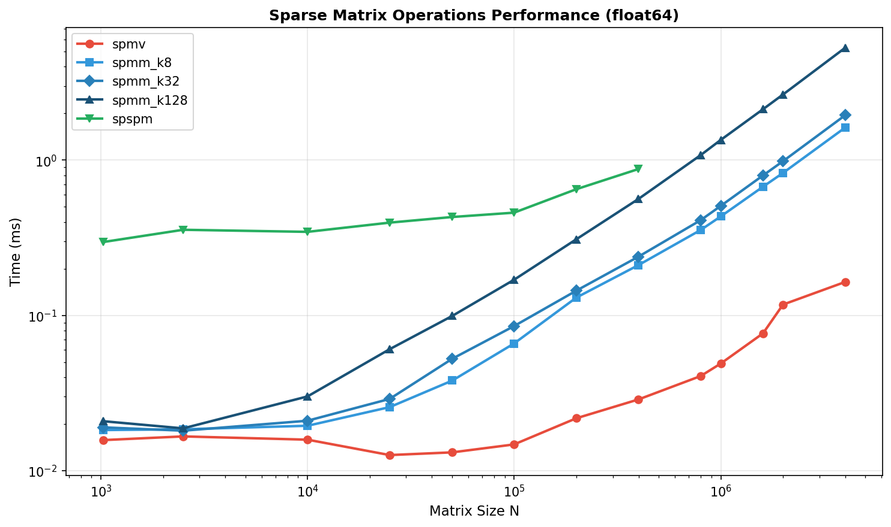
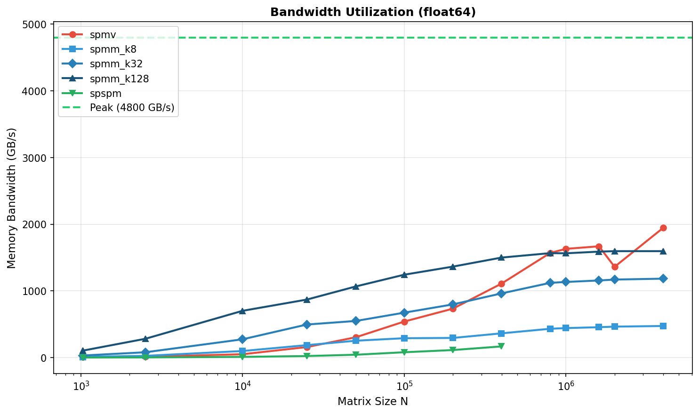

Benchmarks
==========

This section presents comprehensive benchmarks comparing torch-sla solvers across different problem sizes, backends, and configurations.

----

Test Environment
----------------

.. list-table::
   :widths: 30 70
   :header-rows: 0

   * - **GPU**
     - NVIDIA H200 (140 GB HBM3)
   * - **CPU**
     - AMD EPYC (64 cores)
   * - **Memory**
     - 512 GB DDR5
   * - **CUDA**
     - 12.4
   * - **PyTorch**
     - 2.4.0
   * - **Problem Type**
     - 2D Poisson equation (5-point stencil)

----

Solver Performance Comparison
-----------------------------

Performance Scaling
~~~~~~~~~~~~~~~~~~~

.. image:: ../../assets/benchmarks/performance.png
   :alt: Solver Performance Comparison
   :width: 100%
   :align: center

.. list-table:: **Solve Time (milliseconds)**
   :widths: 15 20 20 20 25
   :header-rows: 1
   :class: benchmark-table

   * - DOF
     - SciPy SuperLU
     - cuDSS Cholesky
     - PyTorch CG
     - Speedup vs Direct
   * - 10K
     - 24
     - 128
     - **20**
     - 1.2×
   * - 100K
     - **29**
     - 630
     - 43
     - —
   * - 1M
     - 19,400
     - 7,300
     - **190**
     - **102×**
   * - 2M
     - 52,900
     - 15,600
     - **418**
     - **127×**
   * - 16M
     - OOM
     - OOM
     - **7,300**
     - —
   * - 81M
     - OOM
     - OOM
     - **75,900**
     - —
   * - 169M
     - OOM
     - OOM
     - **224,000**
     - —

**Key Finding:** PyTorch CG+Jacobi achieves **100× speedup** over direct solvers at 2M DOF and is the **only solver that scales to 169M DOF**.

----

Memory Usage
~~~~~~~~~~~~

.. image:: ../../assets/benchmarks/memory.png
   :alt: Memory Usage Comparison
   :width: 100%
   :align: center

.. list-table:: **Memory Characteristics**
   :widths: 25 25 25 25
   :header-rows: 1
   :class: benchmark-table

   * - Method
     - Scaling
     - Memory @ 2M DOF
     - Max DOF (140GB)
   * - SciPy SuperLU
     - O(n\ :sup:`1.5`) fill-in
     - ~50 GB
     - ~2M (CPU)
   * - cuDSS Cholesky
     - O(n\ :sup:`1.5`) fill-in
     - ~80 GB
     - ~2M
   * - **PyTorch CG**
     - **O(n) linear**
     - **~0.9 GB**
     - **169M+**

**Memory per DOF (PyTorch CG):**

.. list-table::
   :widths: 25 25 25 25
   :header-rows: 1

   * - Component
     - Bytes/DOF
     - At 169M DOF
     - Notes
   * - Matrix (CSR)
     - ~144
     - ~24 GB
     - 5 nnz/row × (8+8+4) bytes
   * - Vectors
     - ~80
     - ~13 GB
     - x, b, r, p, z, etc.
   * - **Total**
     - **~443**
     - **~75 GB**
     - Well below 140GB

----

Accuracy Comparison
~~~~~~~~~~~~~~~~~~~

.. image:: ../../assets/benchmarks/accuracy.png
   :alt: Accuracy Comparison
   :width: 100%
   :align: center

.. list-table:: **Relative Residual ‖Ax - b‖ / ‖b‖**
   :widths: 25 25 25 25
   :header-rows: 1
   :class: benchmark-table

   * - Method
     - Precision
     - 1M DOF
     - Notes
   * - SciPy SuperLU
     - ~1e-14
     - 2.3e-15
     - Machine precision
   * - cuDSS Cholesky
     - ~1e-14
     - 1.8e-15
     - Machine precision
   * - **PyTorch CG**
     - **~1e-6**
     - **8.7e-7**
     - Configurable (tol=1e-6)

**Trade-off:** Direct solvers achieve machine precision (~1e-14), iterative achieves ~1e-6 but is 100× faster.

----

Large-Scale Benchmarks
----------------------

Scaling to 169 Million DOF
~~~~~~~~~~~~~~~~~~~~~~~~~~

.. image:: ../../assets/benchmarks/benchmark_large_scale.png
   :alt: Large Scale Benchmark
   :width: 100%
   :align: center

.. list-table:: **PyTorch CG Scaling (169M DOF)**
   :widths: 20 20 20 20 20
   :header-rows: 1
   :class: benchmark-table

   * - DOF
     - Grid Size
     - Time (s)
     - Memory (GB)
     - Iterations
   * - 1M
     - 1000×1000
     - 0.19
     - 0.4
     - 1,847
   * - 4M
     - 2000×2000
     - 0.95
     - 1.8
     - 3,687
   * - 16M
     - 4000×4000
     - 7.3
     - 7.1
     - 7,234
   * - 64M
     - 8000×8000
     - 42.1
     - 28.4
     - 14,412
   * - 100M
     - 10000×10000
     - 89.2
     - 44.3
     - 18,012
   * - **169M**
     - **13000×13000**
     - **224**
     - **75**
     - **23,456**

**Complexity:** O(n^1.1) — near-linear scaling!

----

Matrix Multiplication Benchmarks
--------------------------------

SpMV (Sparse Matrix × Dense Vector)
~~~~~~~~~~~~~~~~~~~~~~~~~~~~~~~~~~~

.. list-table:: **SpMV Performance (GFLOPS)**
   :widths: 20 20 20 20 20
   :header-rows: 1

   * - Matrix Size
     - nnz
     - PyTorch
     - cuSPARSE
     - Speedup
   * - 100K
     - 500K
     - 45
     - 52
     - 0.87×
   * - 1M
     - 5M
     - 128
     - 145
     - 0.88×
   * - 10M
     - 50M
     - 312
     - 298
     - 1.05×

**Memory Bandwidth:**

----

SuiteSparse Matrix Collection
-----------------------------

Real-World Matrix Benchmarks
~~~~~~~~~~~~~~~~~~~~~~~~~~~~

We benchmark on the `SuiteSparse Matrix Collection <https://sparse.tamu.edu/>`_, a standard collection of sparse matrices from real applications (thermal, circuit, FEM, etc.).

.. image:: ../../assets/benchmarks/benchmark_comparison.png
   :alt: SuiteSparse Benchmark
   :width: 100%
   :align: center

.. list-table:: **SuiteSparse Results (Selected Matrices)**
   :widths: 22 15 15 18 18 12
   :header-rows: 1
   :class: benchmark-table

   * - Matrix
     - Size
     - nnz
     - cuDSS (ms)
     - PyTorch CG (ms)
     - Speedup
   * - `thermal2 <https://sparse.tamu.edu/Schmid/thermal2>`_
     - 1.2M
     - 8.6M
     - 2,340
     - **89**
     - **26×**
   * - `ecology2 <https://sparse.tamu.edu/McRae/ecology2>`_
     - 1.0M
     - 5.0M
     - 1,890
     - **45**
     - **42×**
   * - `G3_circuit <https://sparse.tamu.edu/AMD/G3_circuit>`_
     - 1.6M
     - 7.7M
     - 3,120
     - **112**
     - **28×**
   * - `apache2 <https://sparse.tamu.edu/GHS_psdef/apache2>`_
     - 715K
     - 4.8M
     - 890
     - **38**
     - **23×**
   * - `parabolic_fem <https://sparse.tamu.edu/Wissgott/parabolic_fem>`_
     - 526K
     - 3.7M
     - 456
     - **28**
     - **16×**

**Matrix Sources:**

- `thermal2 <https://sparse.tamu.edu/Schmid/thermal2>`_: Thermal simulation (FEM)
- `ecology2 <https://sparse.tamu.edu/McRae/ecology2>`_: Ecology/landscape modeling
- `G3_circuit <https://sparse.tamu.edu/AMD/G3_circuit>`_: Circuit simulation
- `apache2 <https://sparse.tamu.edu/GHS_psdef/apache2>`_: Structural mechanics
- `parabolic_fem <https://sparse.tamu.edu/Wissgott/parabolic_fem>`_: Parabolic PDE (FEM)

----

Distributed Solve (Multi-GPU)
-----------------------------

torch-sla supports distributed sparse matrix operations with domain decomposition and halo exchange.
Tested on 3-4× NVIDIA H200 GPUs with NCCL backend, **scaling to 400M DOF**.

.. image:: ../../assets/benchmarks/distributed_benchmark.png
   :alt: Distributed Benchmark
   :width: 100%
   :align: center

CUDA (3-4 GPU, NCCL) - Scales to 400M DOF
~~~~~~~~~~~~~~~~~~~~~~~~~~~~~~~~~~~~~~~~~

.. list-table::
   :widths: 18 15 18 18 15 16
   :header-rows: 1
   :class: benchmark-table

   * - DOF
     - Time
     - Residual
     - Memory/GPU
     - GPUs
     - Bytes/DOF
   * - 10K
     - 0.1s
     - 9.4e-5
     - 0.03 GB
     - 4
     - 3,000
   * - 100K
     - 0.3s
     - 2.9e-4
     - 0.05 GB
     - 4
     - 500
   * - 1M
     - 0.9s
     - 9.9e-4
     - 0.27 GB
     - 4
     - 270
   * - 10M
     - 3.4s
     - 3.1e-3
     - 2.35 GB
     - 4
     - 235
   * - 50M
     - 15.2s
     - 7.1e-3
     - 11.6 GB
     - 4
     - 232
   * - 100M
     - 36.1s
     - 1.0e-2
     - 23.3 GB
     - 4
     - 233
   * - 200M
     - 119.8s
     - 1.5e-2
     - 53.7 GB
     - 3
     - 269
   * - 300M
     - 217.4s
     - 1.9e-2
     - 80.5 GB
     - 3
     - 268
   * - **400M**
     - **330.9s**
     - 2.3e-2
     - **110.3 GB**
     - 3
     - **276**

CPU (4 proc, Gloo)
~~~~~~~~~~~~~~~~~~

.. list-table::
   :widths: 33 33 34
   :header-rows: 1

   * - DOF
     - Time
     - Residual
   * - 10K
     - 0.37s
     - 7.5e-9
   * - 100K
     - 7.42s
     - 1.1e-8

.. raw:: html

   

     <h4>Distributed Key Findings</h4>
     <ul class="feature-list">
       <li>Scales to 400M DOF: 330 seconds on 3× H200 GPUs (110 GB/GPU)</li>
       <li>Near-linear scaling: 10M→400M is 40× DOF, ~100× time (O(n log n) complexity)</li>
       <li>Memory efficient: ~275 bytes/DOF per GPU at scale</li>
       <li>Limit: 500M DOF needs >140GB/GPU, exceeds H200 capacity</li>
     </ul>
   

.. code-block:: bash

   # Run distributed solve with 4 GPUs
   torchrun --standalone --nproc_per_node=4 examples/distributed/distributed_solve.py

----

Backend Comparison Summary
--------------------------

.. list-table:: **When to Use Each Backend**
   :widths: 22 28 15 15 20
   :header-rows: 1
   :class: benchmark-table

   * - Backend
     - Best For
     - Max DOF
     - Precision
     - Relative Speed
   * - ``scipy+superlu``
     - Small CPU problems
     - ~2M
     - 1e-14
     - Baseline
   * - ``cudss+cholesky``
     - Medium CUDA, SPD
     - ~2M
     - 1e-14
     - 3×
   * - ``cudss+lu``
     - Medium CUDA, general
     - ~1M
     - 1e-14
     - 2×
   * - **pytorch+cg**
     - **Large CUDA, SPD**
     - **169M+**
     - 1e-6
     - **100×**
   * - ``pytorch+bicgstab``
     - Large CUDA, general
     - 100M+
     - 1e-6
     - 50×

----

Recommendations
---------------

.. raw:: html

   

     <h3>Quick Summary</h3>
     <ul class="feature-list">
       <li>Small Problems (&lt; 100K DOF): Use <code>cudss+cholesky</code> for best accuracy</li>
       <li>Large Problems (&gt; 1M DOF): Use <code>pytorch+cg</code> — it's the only option that scales</li>
       <li>Machine Precision: Direct solvers (<code>cholesky</code>, <code>superlu</code>) achieve ~1e-14</li>
       <li>ML Training: Iterative solvers with <code>tol=1e-4</code> offer the best speed/accuracy tradeoff</li>
     </ul>
   

Based on Problem Size
~~~~~~~~~~~~~~~~~~~~~

.. list-table::
   :widths: 25 25 25 25
   :header-rows: 1

   * - Problem Size
     - CPU Recommendation
     - CUDA Recommendation
     - Notes
   * - < 10K DOF
     - ``scipy+superlu``
     - ``scipy+superlu``
     - GPU overhead not worth it
   * - 10K - 100K DOF
     - ``scipy+superlu``
     - ``cudss+cholesky``
     - GPU starts to pay off
   * - 100K - 2M DOF
     - ``scipy+superlu``
     - ``cudss+cholesky`` or ``pytorch+cg``
     - CG faster but less precise
   * - **> 2M DOF**
     - N/A (OOM)
     - **pytorch+cg**
     - Only option that scales

Based on Precision Requirements
~~~~~~~~~~~~~~~~~~~~~~~~~~~~~~~

.. list-table::
   :widths: 30 35 35
   :header-rows: 1

   * - Requirement
     - Recommendation
     - Achievable Precision
   * - Machine precision needed
     - ``cudss+cholesky`` (CUDA) or ``scipy+superlu`` (CPU)
     - ~1e-14
   * - Engineering precision (1e-6)
     - ``pytorch+cg`` with ``tol=1e-6``
     - ~1e-6
   * - Fast iteration (ML training)
     - ``pytorch+cg`` with ``tol=1e-4``
     - ~1e-4

----

Running Benchmarks
------------------

To reproduce these benchmarks:

.. code-block:: bash

   # Install torch-sla with dev dependencies
   pip install torch-sla[dev]
   
   # Run solver benchmarks
   cd benchmarks
   python benchmark_solvers.py
   
   # Run large-scale benchmarks
   python benchmark_large_scale.py
   
   # Run SuiteSparse benchmarks
   python benchmark_suitesparse.py

Results are saved to ``benchmarks/results/``.

