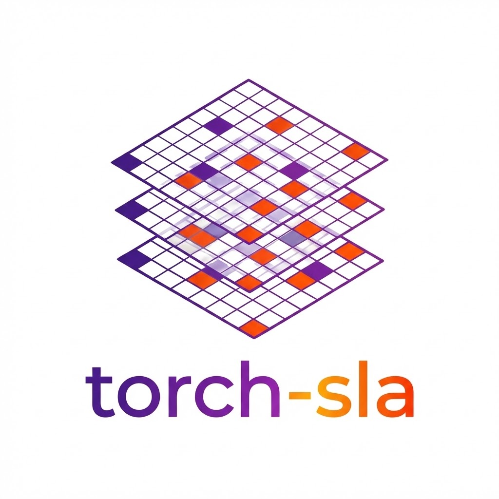

.. torch-sla documentation master file
.. meta::
   :description: torch-sla - Differentiable sparse linear algebra library for PyTorch with CUDA support
   :keywords: PyTorch, sparse matrix, linear algebra, CUDA, cuSOLVER, cuDSS, sparse solver, differentiable, autograd, FEM, CFD

torch-sla: Torch Sparse Linear Algebra
======================================

.. raw:: html

   
<strong>torch-sla</strong> (Torch Sparse Linear Algebra) is a memory-efficient, differentiable sparse linear equation solver library for PyTorch with multiple backends. Perfect for scientific computing, FEM, CFD, and machine learning applications requiring sparse matrix operations with automatic differentiation.

.. raw:: html

   

     
     
     
   

Why torch-sla?
--------------

.. raw:: html

   <ul class="feature-list">
     <li>🚀 High Performance: CUDA-accelerated solvers via cuSOLVER and cuDSS</li>
     <li>💾 Memory Efficient: Store only non-zero elements, enabling solving of systems with millions of unknowns</li>
     <li>🔄 Differentiable: Full gradient support through <code>torch.autograd</code></li>
     <li>📦 Batch Processing: Solve thousands of systems in parallel</li>
     <li>🌐 Distributed: Domain decomposition with halo exchange for large-scale problems</li>
     <li>🔧 Flexible: Multiple backends and solver methods</li>
   </ul>

Key Features
------------

.. raw:: html

   <ul class="feature-list">
     <li>Memory efficient: Only stores non-zero elements — a 1M×1M matrix with 1% density uses ~80MB instead of ~8TB</li>
     <li>Full gradient support via torch.autograd for end-to-end differentiable pipelines</li>
     <li>Multiple backends: <a href="https://docs.scipy.org/doc/scipy/reference/sparse.linalg.html">SciPy</a>, <a href="https://eigen.tuxfamily.org/">Eigen</a>, <a href="https://docs.nvidia.com/cuda/cusolver/">cuSOLVER</a>, <a href="https://docs.nvidia.com/cuda/cudss/">cuDSS</a></li>
     <li>Batch solving: Same-layout and different-layout sparse matrices</li>
     <li>Distributed solving: Domain decomposition with halo exchange</li>
     <li>169M+ DOF tested: Scales to very large problems with near-linear complexity</li>
   </ul>

Quick Start
-----------

Installation
~~~~~~~~~~~~

.. code-block:: bash

   pip install torch-sla

Basic Usage
~~~~~~~~~~~

.. code-block:: python

   import torch
   from torch_sla import SparseTensor

   # Create a sparse matrix in COO format
   val = torch.tensor([4.0, -1.0, -1.0, 4.0, -1.0, -1.0, 4.0], dtype=torch.float64)
   row = torch.tensor([0, 0, 1, 1, 1, 2, 2])
   col = torch.tensor([0, 1, 0, 1, 2, 1, 2])

   A = SparseTensor(val, row, col, (3, 3))

   # Solve Ax = b
   b = torch.tensor([1.0, 2.0, 3.0], dtype=torch.float64)
   x = A.solve(b)

CUDA Acceleration
~~~~~~~~~~~~~~~~~

.. code-block:: python

   # Move to GPU for CUDA-accelerated solving
   A_cuda = A.cuda()
   b_cuda = b.cuda()
   x = A_cuda.solve(b_cuda)  # Uses cuDSS or cuSOLVER automatically

Use Cases
---------

torch-sla is ideal for:

- **Finite Element Method (FEM)**: Solve large sparse systems from FEM discretization
- **Computational Fluid Dynamics (CFD)**: Efficient sparse solvers for Navier-Stokes
- **Physics-Informed Neural Networks (PINNs)**: Differentiable sparse operations for physics constraints
- **Graph Neural Networks**: Sparse message passing and Laplacian operations
- **Optimization**: Gradient-based optimization involving sparse linear systems

.. toctree::
   :maxdepth: 2
   :caption: Documentation:

   introduction
   installation
   torch_sla
   examples
   benchmarks

----

Frequently Asked Questions (FAQ)
================================

What is torch-sla?
------------------

torch-sla (Torch Sparse Linear Algebra) is a Python library that provides differentiable sparse linear equation solvers for PyTorch. It solves systems of the form Ax = b where A is a sparse matrix, with full support for automatic differentiation (autograd) and GPU acceleration via CUDA.

How do I solve a sparse linear system in PyTorch?
-------------------------------------------------

Use torch-sla's ``SparseTensor`` class:

.. code-block:: python

   from torch_sla import SparseTensor
   
   # Create sparse matrix from COO format (values, row indices, column indices)
   A = SparseTensor(values, row, col, shape)
   
   # Solve Ax = b
   x = A.solve(b)

This works on both CPU and GPU, and supports gradient computation.

What sparse solvers does torch-sla support?
-------------------------------------------

torch-sla supports multiple backends:

- **CPU**: SciPy (SuperLU, UMFPACK, CG, BiCGStab, GMRES), Eigen (CG, BiCGStab)
- **GPU**: cuSOLVER (QR, Cholesky, LU), cuDSS (LU, Cholesky, LDLT)

The library automatically selects the best solver based on your hardware and matrix properties.

Can I compute gradients through sparse solve?
---------------------------------------------

Yes. torch-sla fully supports PyTorch autograd:

.. code-block:: python

   val = torch.tensor([...], requires_grad=True)
   x = spsolve(val, row, col, shape, b)
   loss = x.sum()
   loss.backward()  # Computes gradients w.r.t. val and b

How do I solve batched sparse systems?
--------------------------------------

torch-sla supports batched solving for matrices with the same sparsity pattern:

.. code-block:: python

   # Batched values: [batch_size, nnz]
   A = SparseTensor(val_batch, row, col, (batch_size, M, N))
   x = A.solve(b_batch)  # Solves all systems in parallel

For matrices with different patterns, use ``SparseTensorList``.

How do I use torch-sla on GPU?
------------------------------

Simply move your tensors to CUDA:

.. code-block:: python

   A_cuda = A.cuda()
   x = A_cuda.solve(b.cuda())  # Uses cuDSS or cuSOLVER

What is the difference between SparseTensor and DSparseTensor?
--------------------------------------------------------------

- ``SparseTensor``: Single sparse matrix (optionally batched), for standard solving
- ``DSparseTensor``: Distributed sparse tensor with domain decomposition, for large-scale parallel computing with halo exchange

Comparison with Alternatives
============================

torch-sla vs scipy.sparse.linalg
--------------------------------

.. list-table::
   :widths: 30 35 35
   :header-rows: 1
   :class: comparison-table

   * - Feature
     - **torch-sla** ✅
     - scipy.sparse.linalg
   * - PyTorch Integration
     - ✅ **Native tensors**
     - ❌ Requires numpy copy
   * - GPU Acceleration
     - ✅ **CUDA (cuDSS, cuSOLVER)**
     - ❌ CPU only
   * - Autograd Gradients
     - ✅ **Full support (adjoint)**
     - ❌ No gradients
   * - Batched Solve
     - ✅ **Parallel batch solve**
     - ❌ Loop required
   * - Large Scale (>2M DOF)
     - ✅ **169M DOF tested**
     - ⚠️ Memory limited
   * - Distributed Computing
     - ✅ **DSparseTensor**
     - ❌ Not supported
   * - Eigenvalue/SVD
     - ✅ **Differentiable**
     - ⚠️ No gradients
   * - Nonlinear Solve
     - ✅ **Newton/Anderson**
     - ❌ Not included

torch-sla vs torch.linalg.solve
-------------------------------

.. list-table::
   :widths: 30 35 35
   :header-rows: 1
   :class: comparison-table

   * - Feature
     - **torch-sla** ✅
     - torch.linalg.solve
   * - Matrix Type
     - ✅ **Sparse (COO/CSR)**
     - ❌ Dense only
   * - Memory (1M×1M, 1% density)
     - ✅ **~80 MB**
     - ❌ ~8 TB (impossible)
   * - Max Problem Size
     - ✅ **169M+ DOF**
     - ❌ ~50K (GPU memory)
   * - Specialized Solvers
     - ✅ **LU, Cholesky, CG, BiCGStab**
     - ⚠️ Dense LU only
   * - Batched Operations
     - ✅ **Same/different patterns**
     - ⚠️ Same shape only
   * - GPU Support
     - ✅ **cuDSS, cuSOLVER, PyTorch**
     - ✅ Yes
   * - Autograd
     - ✅ **O(1) graph nodes**
     - ✅ Yes

torch-sla vs PyTorch Geometric (PyG)
------------------------------------

.. list-table::
   :widths: 30 35 35
   :header-rows: 1
   :class: comparison-table

   * - Feature
     - **torch-sla** ✅
     - PyTorch Geometric
   * - Primary Focus
     - ✅ **Sparse Linear Algebra**
     - Graph Neural Networks
   * - Linear System Solve (Ax=b)
     - ✅ **Direct + Iterative**
     - ❌ Not supported
   * - Eigenvalue Decomposition
     - ✅ **Differentiable eigsh/eigs**
     - ❌ Not included
   * - Sparse Matrix Ops
     - ✅ **Full suite (solve, norm, eigs)**
     - ⚠️ SpMM, SpMV only
   * - FEM/CFD Applications
     - ✅ **Designed for**
     - ⚠️ Not primary use
   * - Message Passing
     - ❌ Not included
     - ✅ **Core feature**
   * - GNN Layers
     - ❌ Not included
     - ✅ **Core feature**

**Complementary Usage**: torch-sla and PyG work well together — use PyG for graph learning and torch-sla for solving linear systems on graph Laplacians.

torch-sla vs NVIDIA AmgX
------------------------

.. list-table::
   :widths: 30 35 35
   :header-rows: 1
   :class: comparison-table

   * - Feature
     - **torch-sla** ✅
     - NVIDIA AmgX
   * - Installation
     - ✅ **pip install torch-sla**
     - ❌ Complex build process
   * - PyTorch Integration
     - ✅ **Native**
     - ❌ Requires wrapper
   * - Autograd Support
     - ✅ **Full gradient flow**
     - ❌ No gradients
   * - Python API
     - ✅ **Pythonic**
     - ⚠️ C++ focused
   * - Multigrid (AMG)
     - ❌ Not yet
     - ✅ **Core feature**
   * - Preconditioners
     - ⚠️ Jacobi
     - ✅ **ILU, AMG, etc.**
   * - Documentation
     - ✅ **Comprehensive**
     - ⚠️ Limited examples

torch-sla vs PETSc
------------------

.. list-table::
   :widths: 30 35 35
   :header-rows: 1
   :class: comparison-table

   * - Feature
     - **torch-sla** ✅
     - PETSc
   * - Installation
     - ✅ **pip install**
     - ❌ Complex (MPI, compilers)
   * - Learning Curve
     - ✅ **Simple Python API**
     - ❌ Steep (C/Fortran heritage)
   * - PyTorch Integration
     - ✅ **Native tensors**
     - ❌ Requires petsc4py + copies
   * - Autograd
     - ✅ **Full support**
     - ❌ No gradients
   * - Solver Variety
     - ⚠️ Core methods
     - ✅ **Extensive (KSP, SNES)**
   * - MPI Distributed
     - ⚠️ DSparseTensor (shared memory)
     - ✅ **Full MPI support**
   * - Production Scale
     - ⚠️ 169M DOF tested
     - ✅ **Exascale proven**

Summary: When to Use torch-sla
------------------------------

.. list-table::
   :widths: 50 50
   :header-rows: 1

   * - Use torch-sla When
     - Consider Alternatives When
   * - ✅ You need **PyTorch integration**
     - You're not using PyTorch
   * - ✅ You need **gradient flow** through solve
     - Gradients not needed
   * - ✅ Problem size **< 169M DOF**
     - Exascale problems (use PETSc)
   * - ✅ You want **simple pip install**
     - You need AMG preconditioners (AmgX)
   * - ✅ **Batched** sparse systems
     - Complex preconditioning (PETSc)
   * - ✅ **GPU acceleration** with minimal setup
     - Full MPI distributed (PETSc)

Indices and Search
==================

* :ref:`genindex`
* :ref:`search`

License
-------

torch-sla is released under the MIT License. See `LICENSE <https://github.com/walkerchi/torch-sla/blob/main/LICENSE>`_ for details.

Citation
--------

If you use torch-sla in your research, please cite:

.. code-block:: bibtex

   @software{torch_sla,
     title = {torch-sla: Torch Sparse Linear Algebra},
     author = {Walker Chi},
     year = {2024},
     url = {https://github.com/walkerchi/torch-sla}
   }
